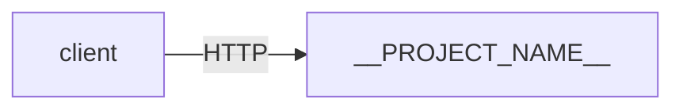

# __PROJECT_TITLE__

**Category:** `__CATEGORY__` · **Stack:** Python 3.12

## 1. Problem statement

_What are we building and why? What problem does it solve?_

## 2. Requirements

### Functional
- [ ] _List the things this system must do_

### Non-functional
- **Scale:** _expected QPS, data volume, number of users_
- **Latency:** _p50 / p95 / p99 targets_
- **Consistency:** _strong / eventual / read-your-writes / etc._
- **Availability:** _e.g. 99.9%_

## 3. API / interface

_HTTP endpoints, message schemas, CLI commands, etc._

```http
GET /health
→ 200 {"service":"__PROJECT_NAME__","status":"ok"}
```

## 4. Architecture

_Components and data flow. Use a mermaid diagram when it helps._



## 5. Data model

_Schemas, indexes, partitioning strategy, retention policy._

## 6. Trade-offs & alternatives

_What was considered, what was chosen, why._

| Decision | Chosen | Alternative | Reasoning |
|---|---|---|---|
| ... | ... | ... | ... |

## 7. How to run

```bash
make up      # start app + dependencies
make test    # run tests
make logs    # tail app logs
make down    # stop and clean volumes
```

Local dev (without Docker):
```bash
make install
make dev
```

## 8. What I learned

_Short retrospective written after building this. Surprises, mistakes, next time._
