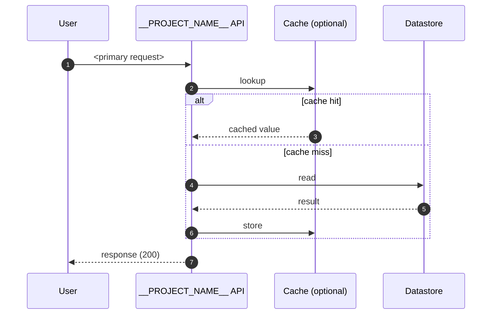
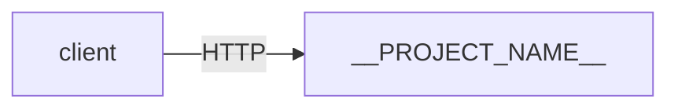

# Diagram-First Design (Plan E) Implementation Plan

> **For agentic workers:** REQUIRED SUB-SKILL: Use superpowers:subagent-driven-development (recommended) or superpowers:executing-plans to implement this plan task-by-task. Steps use checkbox (`- [ ]`) syntax for tracking.

**Goal:** Make architecture diagrams a first-class, mandatory artifact of every project: source as Mermaid `.mmd` files, rendered to committed `.svg` via `make diagram`, with a `make design-check` gate that asserts both diagrams (context + sequence happy-path) exist and the design doc is non-trivial.

**Architecture:** Per-project template additions (two `.mmd` starter files, gitignore for scratch artifacts), per-project Makefile gets `diagram` and `design-check` targets. Rendering uses the official `minlag/mermaid-cli` Docker image so no local Node install is needed.

**Tech Stack:** Mermaid via `minlag/mermaid-cli` Docker image. GNU Make. Bash for tests.

**Spec:** [`docs/superpowers/specs/2026-06-28-agent-enablement-diagrams-learning-design.md`](../specs/2026-06-28-agent-enablement-diagrams-learning-design.md) (Bundle E)

**Depends on:** Plan D landed (per-project `AGENTS.md` / `DONE.md` already reference diagrams).

---

## File Map

**Create (per-project templates, applied to BOTH `_templates/node/` and `_templates/python/`):**
- `docs/diagrams/00-context.mmd` — C4 Context starter
- `docs/diagrams/01-sequence-happy-path.mmd` — sequence diagram starter
- `docs/diagrams/.gitignore` — allow scratch `*.tmp.svg`

**Modify (per-project templates):**
- `Makefile` — add `diagram` and `design-check` targets
- `README.md` — §4 (Architecture) section gets explicit references to both diagrams and a `make diagram` reminder

**Modify (repo-level):**
- `AGENTS.md` — extend the "Project lifecycle" section to mention `make diagram` and `make design-check`

**Create (tests):**
- New tests in `scripts/tests/test_new_project.sh` for scaffold output (new files, new Makefile targets)
- New tests in `scripts/tests/test_diagram_render.sh` for the rendering sandbox flow
- New tests in `scripts/tests/test_design_check.sh` for design-check pass/fail behavior

---

## Task 1: Per-project diagram source files — Node side

**Files:**
- Create: `_templates/node/docs/diagrams/00-context.mmd`
- Create: `_templates/node/docs/diagrams/01-sequence-happy-path.mmd`
- Create: `_templates/node/docs/diagrams/.gitignore`

- [ ] **Step 1: Create directory and `.gitignore`**

```bash
mkdir -p /Users/dong.kyh/works/system-designs/_templates/node/docs/diagrams
```

`_templates/node/docs/diagrams/.gitignore`:

```gitignore
# Scratch rendering artifacts (anything ending .tmp.svg or .tmp.png)
*.tmp.svg
*.tmp.png

# Mermaid CLI puppeteer dump on failure
puppeteer-error.html
```

- [ ] **Step 2: Create `_templates/node/docs/diagrams/00-context.mmd`**

```mermaid
%%
%% C4 Context — __PROJECT_TITLE__
%%
%% This is the highest-level view: WHO uses your system, and WHAT
%% external systems does it talk to. Avoid internals; one box per
%% actor and one box per external dependency.
%%
%% Render with `make diagram` from the project root.
%%

flowchart LR
    user["👤 User<br/>Client of __PROJECT_NAME__"]
    app["__PROJECT_NAME__<br/>(this system)"]
    extdb[("External datastore<br/>(e.g., Postgres, S3, ...)")]
    extsvc["Downstream service<br/>(e.g., payment provider)"]

    user -->|HTTP / RPC| app
    app -->|reads / writes| extdb
    app -->|calls| extsvc

    classDef thisSystem fill:#dbeafe,stroke:#1d4ed8,stroke-width:2px;
    class app thisSystem
```

- [ ] **Step 3: Create `_templates/node/docs/diagrams/01-sequence-happy-path.mmd`**



- [ ] **Step 4: Commit**

```bash
cd /Users/dong.kyh/works/system-designs
git add _templates/node/docs/diagrams/
git commit -m "feat(templates/node): add diagram source templates (context + sequence)

Two Mermaid .mmd files per project as starting points:
- docs/diagrams/00-context.mmd — C4 Context (who calls, who's called)
- docs/diagrams/01-sequence-happy-path.mmd — primary use case trace

.gitignore allows scratch *.tmp.svg without committing them. Headers
explain when each diagram type matters and how to render.

Co-authored-by: Copilot <223556219+Copilot@users.noreply.github.com>"
```

---

## Task 2: Per-project diagram source files — Python side

Same three files in the Python template, identical content (no language-specific text in the diagram source).

**Files:**
- Create: `_templates/python/docs/diagrams/00-context.mmd`
- Create: `_templates/python/docs/diagrams/01-sequence-happy-path.mmd`
- Create: `_templates/python/docs/diagrams/.gitignore`

- [ ] **Step 1: Create directory**

```bash
mkdir -p /Users/dong.kyh/works/system-designs/_templates/python/docs/diagrams
```

- [ ] **Step 2: Create the three files**

Copy verbatim from Task 1 (Steps 1, 2, 3 contents):
- `_templates/python/docs/diagrams/.gitignore` — same as Node version
- `_templates/python/docs/diagrams/00-context.mmd` — same as Node version
- `_templates/python/docs/diagrams/01-sequence-happy-path.mmd` — same as Node version

- [ ] **Step 3: Commit**

```bash
cd /Users/dong.kyh/works/system-designs
git add _templates/python/docs/diagrams/
git commit -m "feat(templates/python): add diagram source templates (context + sequence)

Mirror of the Node template's docs/diagrams/ — same .mmd content,
identical .gitignore. No language-specific text in the diagrams.

Co-authored-by: Copilot <223556219+Copilot@users.noreply.github.com>"
```

---

## Task 3: `make diagram` and `make design-check` Makefile targets — Node side

**Files:**
- Modify: `_templates/node/Makefile`

- [ ] **Step 1: Update `.PHONY` line in `_templates/node/Makefile`**

Locate the existing line:
```makefile
.PHONY: up down build test lint logs shell install dev clean
```
Replace with:
```makefile
.PHONY: up down build test lint logs shell install dev clean diagram design-check
```

- [ ] **Step 2: Append the new targets to the END of `_templates/node/Makefile`**

```makefile

# --- diagram rendering ---
# Renders every docs/diagrams/*.mmd to *.svg using the official
# Mermaid CLI Docker image. Zero local install required.
MERMAID_IMAGE := minlag/mermaid-cli:11.4.2

diagram:
	@if ! command -v docker >/dev/null 2>&1; then \
	  echo "error: docker required for 'make diagram'" >&2; \
	  echo "       install Docker Desktop or OrbStack, then retry" >&2; \
	  exit 1; \
	fi
	@count=$$(ls docs/diagrams/*.mmd 2>/dev/null | wc -l | tr -d ' '); \
	if [ "$$count" = "0" ]; then echo "no diagrams under docs/diagrams/*.mmd"; exit 0; fi
	@for src in docs/diagrams/*.mmd; do \
	  out="$${src%.mmd}.svg"; \
	  echo "render $$src -> $$out"; \
	  docker run --rm -u $$(id -u):$$(id -g) \
	    -v "$$PWD":/data $(MERMAID_IMAGE) \
	    -i "/data/$$src" -o "/data/$$out" >/dev/null || exit 1; \
	done

# --- design completeness gate ---
# Asserts the project's design artifacts are present and non-trivial
# before declaring it ready for review/merge/finalize.
design-check:
	@fail=0; \
	for s in 00-context 01-sequence-happy-path; do \
	  if [ ! -f "docs/diagrams/$$s.svg" ]; then \
	    echo "design-check: missing docs/diagrams/$$s.svg (run 'make diagram')" >&2; \
	    fail=1; \
	  fi; \
	done; \
	for section in "## 1. Problem statement" "## 2. Requirements" "## 4. Architecture"; do \
	  if ! grep -qF "$$section" README.md; then \
	    echo "design-check: README.md missing section '$$section'" >&2; \
	    fail=1; \
	  fi; \
	done; \
	if grep -qE "_What are we building and why\?_|_List the things this system must do_" README.md; then \
	  echo "design-check: README.md still contains template placeholder text" >&2; \
	  echo "             (sections 1 or 2 not yet filled)" >&2; \
	  fail=1; \
	fi; \
	if [ $$fail -eq 0 ]; then echo "design-check: OK"; else exit 1; fi
```

- [ ] **Step 3: Sanity check the Node Makefile parses**

```bash
TMP=$(mktemp -d)
cp -R /Users/dong.kyh/works/system-designs/_templates/node "$TMP/check"
( cd "$TMP/check" && make -n diagram 2>&1 | head -5 )
( cd "$TMP/check" && make -n design-check 2>&1 | head -5 )
rm -rf "$TMP"
```
Expected: `make -n` (dry run) prints the commands it WOULD execute, with no syntax errors. The output should mention `docker run` for diagram and the grep checks for design-check.

- [ ] **Step 4: Commit**

```bash
cd /Users/dong.kyh/works/system-designs
git add _templates/node/Makefile
git commit -m "feat(templates/node): add 'make diagram' and 'make design-check'

diagram: renders every docs/diagrams/*.mmd to .svg using the official
minlag/mermaid-cli Docker image (pinned to 11.4.2). No local Node
install required. Fails fast with a clear message if Docker isn't
available.

design-check: asserts both starter diagrams have been rendered, the
required README sections exist, and the README no longer contains the
default placeholder copy. This is the project's pre-finalize gate.

Co-authored-by: Copilot <223556219+Copilot@users.noreply.github.com>"
```

---

## Task 4: `make diagram` and `make design-check` Makefile targets — Python side

Same two targets, identical content (no language-specific text in either).

**Files:**
- Modify: `_templates/python/Makefile`

- [ ] **Step 1: Update `.PHONY` in `_templates/python/Makefile`**

Locate:
```makefile
.PHONY: up down test lint logs shell install dev clean
```
Replace with:
```makefile
.PHONY: up down test lint logs shell install dev clean diagram design-check
```

- [ ] **Step 2: Append the same two targets as Task 3 Step 2 to `_templates/python/Makefile`**

Copy the entire block beginning at `# --- diagram rendering ---` through the end of `design-check` verbatim. No edits.

- [ ] **Step 3: Sanity check the Python Makefile parses**

```bash
TMP=$(mktemp -d)
cp -R /Users/dong.kyh/works/system-designs/_templates/python "$TMP/check"
( cd "$TMP/check" && make -n diagram 2>&1 | head -5 )
( cd "$TMP/check" && make -n design-check 2>&1 | head -5 )
rm -rf "$TMP"
```

- [ ] **Step 4: Commit**

```bash
cd /Users/dong.kyh/works/system-designs
git add _templates/python/Makefile
git commit -m "feat(templates/python): add 'make diagram' and 'make design-check'

Identical to the Node template additions.

Co-authored-by: Copilot <223556219+Copilot@users.noreply.github.com>"
```

---

## Task 5: README template — reference the diagrams in §4 (Architecture)

**Files:**
- Modify: `_templates/node/README.md`
- Modify: `_templates/python/README.md`

- [ ] **Step 1: Update the §4 (Architecture) section in `_templates/node/README.md`**

Locate the existing block:

```markdown
## 4. Architecture

_Components and data flow. Use a mermaid diagram when it helps._


```

Replace the entire block (including the existing mermaid example) with:

```markdown
## 4. Architecture

Diagrams live under `docs/diagrams/` as Mermaid source (`.mmd`). Render
them to SVG with `make diagram` (uses the official Mermaid CLI Docker
image — no local Node install needed). Re-render after every edit.

**Context** (who calls, who's called) — see [`docs/diagrams/00-context.svg`](./docs/diagrams/00-context.svg)
([source](./docs/diagrams/00-context.mmd)):


**Happy-path sequence** (one primary request, end-to-end) — see
[`docs/diagrams/01-sequence-happy-path.svg`](./docs/diagrams/01-sequence-happy-path.svg)
([source](./docs/diagrams/01-sequence-happy-path.mmd)):


_Explain the components and data flow below — what each box does, why
the boundaries are where they are, and what each arrow means._
```

- [ ] **Step 2: Apply the same change to `_templates/python/README.md`**

Same edit as Step 1. The block content is stack-agnostic.

- [ ] **Step 3: Commit**

```bash
cd /Users/dong.kyh/works/system-designs
git add _templates/node/README.md _templates/python/README.md
git commit -m "docs(templates): reference diagrams in design doc §4 (Architecture)

Replaces the inline placeholder mermaid block with explicit references
to docs/diagrams/{00-context,01-sequence-happy-path}.svg, the .mmd
sources, and a 'make diagram' reminder. Image embeds make the SVG
visible in any markdown renderer.

Co-authored-by: Copilot <223556219+Copilot@users.noreply.github.com>"
```

---

## Task 6: Repo `AGENTS.md` — extend Project lifecycle

**Files:**
- Modify: `/Users/dong.kyh/works/system-designs/AGENTS.md`

- [ ] **Step 1: Update the Project lifecycle block**

Locate the existing block under `## Project lifecycle`:

```
scaffold      →  make new CATEGORY=<cat> NAME=<name> LANG=<node|python>
design        →  edit <cat>/<name>/README.md sections 1-6; fill docs/
diagram       →  edit docs/diagrams/*.mmd; run `make diagram` to render SVG
implement     →  src/, tests/, then `make test` and `make lint`
finalize      →  fill README §8 retrospective; update DONE.md checkboxes
catalog       →  set .status to 'done'; run `make catalog` at repo root
```

(Plan D's AGENTS.md already lists `diagram`. No change needed if so.)

Now insert a new step BEFORE `finalize`:

```
scaffold      →  make new CATEGORY=<cat> NAME=<name> LANG=<node|python>
design        →  edit <cat>/<name>/README.md sections 1-6; fill docs/
diagram       →  edit docs/diagrams/*.mmd; run `make diagram` to render SVG
implement     →  src/, tests/, then `make test` and `make lint`
gate          →  `make design-check` must pass before marking done
finalize      →  fill README §8 retrospective; update DONE.md checkboxes
catalog       →  set .status to 'done'; run `make catalog` at repo root
```

And update the command-index table — find the row "Render project diagrams" and ensure the row immediately below it for "Validate design completeness" exists (Plan D added it). If both are present, no change needed.

- [ ] **Step 2: Verify and commit**

```bash
cd /Users/dong.kyh/works/system-designs
grep -A3 "## Project lifecycle" AGENTS.md | head
git add AGENTS.md
git commit -m "docs(AGENTS): add 'gate' step to project lifecycle

Inserts 'make design-check' between implement and finalize so agents
know the design must pass the gate before declaring the project done.

Co-authored-by: Copilot <223556219+Copilot@users.noreply.github.com>"
```

(If `git status` shows AGENTS.md unchanged, the gate step was already there from Plan D — skip the commit, the work is done.)

---

## Task 7: Tests — scaffold output, diagram render, design-check

**Files:**
- Modify: `scripts/tests/test_new_project.sh` — extend expected-files lists with `docs/diagrams/`
- Modify: `scripts/tests/test_top_makefile.sh` — assert the project template Makefile has `diagram` and `design-check` (only relevant inside scaffold output; covered by next file)
- Create: `scripts/tests/test_diagram_render.sh` — sandbox render
- Create: `scripts/tests/test_design_check.sh` — pass/fail behavior

### 7A. Extend scaffold expected-files lists

- [ ] **Step 1: Update `test_scaffold_node_creates_expected_files`**

Open `/Users/dong.kyh/works/system-designs/scripts/tests/test_new_project.sh`. Locate `test_scaffold_node_creates_expected_files`. Add three more entries to the file list (alongside the agent files added in Plan D):

```bash
  for f in README.md Dockerfile docker-compose.yml Makefile package.json tsconfig.json \
           .eslintrc.json .prettierrc .env.example .gitignore .dockerignore \
           src/index.ts tests/smoke.test.ts \
           AGENTS.md DONE.md AGENT-PROMPT.md notes/gotchas.md \
           docs/diagrams/00-context.mmd docs/diagrams/01-sequence-happy-path.mmd docs/diagrams/.gitignore; do
```

- [ ] **Step 2: Update `test_scaffold_python_creates_expected_files`**

Same file. Locate the function. Add the same three entries:

```bash
  for f in README.md Dockerfile docker-compose.yml Makefile pyproject.toml \
           .env.example .gitignore .dockerignore \
           src/__init__.py src/main.py tests/__init__.py tests/test_smoke.py \
           AGENTS.md DONE.md AGENT-PROMPT.md notes/gotchas.md \
           docs/diagrams/00-context.mmd docs/diagrams/01-sequence-happy-path.mmd docs/diagrams/.gitignore; do
```

- [ ] **Step 3: Run those tests — expect PASS**

```bash
/Users/dong.kyh/works/system-designs/scripts/tests/run-tests.sh 2>&1 | grep -E "^Results:|test_scaffold_(node|python)_creates"
```
Expected: both PASS.

### 7B. New test file `test_diagram_render.sh`

- [ ] **Step 4: Create `/Users/dong.kyh/works/system-designs/scripts/tests/test_diagram_render.sh`**

```bash
#!/usr/bin/env bash
# Sandbox tests for `make diagram` (Mermaid CLI via Docker).

DIAGRAM_REPO_ROOT="$(cd "$(dirname "${BASH_SOURCE[0]}")/../.." && pwd)"
DIAGRAM_NEW_PROJECT="$DIAGRAM_REPO_ROOT/scripts/new-project.sh"

_setup_diagram_sandbox() {
  local box; box=$(mktemp -d)
  mkdir -p "$box/scripts"
  cp -R "$DIAGRAM_REPO_ROOT/_templates" "$box/_templates"
  cp "$DIAGRAM_NEW_PROJECT" "$box/scripts/new-project.sh"
  chmod +x "$box/scripts/new-project.sh"
  echo "$box"
}

test_make_diagram_renders_starter_files_to_svg() {
  if ! command -v docker >/dev/null 2>&1 || ! docker info >/dev/null 2>&1; then
    echo "SKIP: docker not available"
    return 0
  fi
  local box; box=$(_setup_diagram_sandbox)
  ( cd "$box" && ./scripts/new-project.sh apps diag-test node >/dev/null )
  local proj="$box/apps/diag-test"

  ( cd "$proj" && make diagram ) >/tmp/diag_out.$$ 2>&1
  local rc=$?
  if [ $rc -ne 0 ]; then
    echo "make diagram exited $rc:"
    sed 's/^/    /' /tmp/diag_out.$$
    rm -f /tmp/diag_out.$$
    rm -rf "$box"
    return 1
  fi
  rm -f /tmp/diag_out.$$

  for s in 00-context 01-sequence-happy-path; do
    if [ ! -s "$proj/docs/diagrams/$s.svg" ]; then
      echo "missing or empty $s.svg"
      rm -rf "$box"
      return 1
    fi
    # Sanity-check the file is actually SVG (starts with <svg or <?xml ... svg).
    head -c 200 "$proj/docs/diagrams/$s.svg" | grep -qiE '<svg|<\?xml' || {
      echo "$s.svg doesn't look like SVG"
      head -c 200 "$proj/docs/diagrams/$s.svg"
      rm -rf "$box"
      return 1
    }
  done
  rm -rf "$box"
}
```

- [ ] **Step 5: Run the diagram render test — expect PASS or SKIP**

```bash
/Users/dong.kyh/works/system-designs/scripts/tests/run-tests.sh 2>&1 | grep -E "test_make_diagram_renders"
```
Expected: PASS (if Docker available) or PASS-via-SKIP. First run pulls the `minlag/mermaid-cli` image (~200 MB) and may take 30–60 s.

### 7C. New test file `test_design_check.sh`

- [ ] **Step 6: Create `/Users/dong.kyh/works/system-designs/scripts/tests/test_design_check.sh`**

```bash
#!/usr/bin/env bash
# Tests for `make design-check` pass/fail behavior.

DESIGN_REPO_ROOT="$(cd "$(dirname "${BASH_SOURCE[0]}")/../.." && pwd)"
DESIGN_NEW_PROJECT="$DESIGN_REPO_ROOT/scripts/new-project.sh"

_setup_design_sandbox() {
  local box; box=$(mktemp -d)
  mkdir -p "$box/scripts"
  cp -R "$DESIGN_REPO_ROOT/_templates" "$box/_templates"
  cp "$DESIGN_NEW_PROJECT" "$box/scripts/new-project.sh"
  chmod +x "$box/scripts/new-project.sh"
  echo "$box"
}

test_design_check_fails_on_fresh_scaffold() {
  local box; box=$(_setup_design_sandbox)
  ( cd "$box" && ./scripts/new-project.sh apps design-fail-check node >/dev/null )
  set +e
  ( cd "$box/apps/design-fail-check" && make design-check >/dev/null 2>&1 )
  local rc=$?
  set -e
  rm -rf "$box"
  [ $rc -ne 0 ]
}

test_design_check_passes_when_diagrams_rendered_and_readme_filled() {
  if ! command -v docker >/dev/null 2>&1 || ! docker info >/dev/null 2>&1; then
    echo "SKIP: docker not available (can't render diagrams)"
    return 0
  fi

  local box; box=$(_setup_design_sandbox)
  ( cd "$box" && ./scripts/new-project.sh apps design-pass-check node >/dev/null )
  local proj="$box/apps/design-pass-check"

  # Render diagrams so the gate's SVG check passes.
  ( cd "$proj" && make diagram >/dev/null 2>&1 ) || {
    echo "make diagram failed"
    rm -rf "$box"
    return 1
  }

  # Replace placeholder copy in README §1 and §2 so the gate's "still
  # contains template placeholder" check passes.
  python3 - <<PY
import pathlib
p = pathlib.Path("$proj/README.md")
text = p.read_text()
text = text.replace("_What are we building and why?_", "We are building a thing because reasons.")
text = text.replace("_List the things this system must do_", "Serve 1k QPS at p99 < 50ms.")
p.write_text(text)
PY

  ( cd "$proj" && make design-check >/dev/null 2>&1 )
  local rc=$?
  rm -rf "$box"
  [ $rc -eq 0 ]
}
```

- [ ] **Step 7: Run all design-check tests — expect PASS**

```bash
/Users/dong.kyh/works/system-designs/scripts/tests/run-tests.sh 2>&1 | grep -E "test_design_check"
```
Expected: both tests PASS (second one may PASS-via-SKIP if Docker unavailable).

If the fail-on-fresh-scaffold test PASSES but the pass-when-filled test FAILS, inspect the captured output: it's likely the placeholder strings I'm searching for don't match exactly. Adjust the `text.replace(...)` calls in the test python block to match what's actually in the template README.

- [ ] **Step 8: Full test suite check**

```bash
/Users/dong.kyh/works/system-designs/scripts/tests/run-tests.sh 2>&1 | tail -10
```
Expected: total ~56 passed, 0 failed (52 from Plan D + 4 new: scaffold list updates didn't add new tests, diagram render added 1, design-check added 2; plus the substitution tests were 2 in Plan D).

- [ ] **Step 9: Commit**

```bash
cd /Users/dong.kyh/works/system-designs
git add scripts/tests/
git commit -m "test(scripts): cover diagram render and design-check behaviors

- Extend test_scaffold_{node,python}_creates_expected_files with
  the three docs/diagrams/ files
- Add test_diagram_render.sh: scaffold → 'make diagram' → assert both
  starter .svg files exist and look like SVG. Skips cleanly if Docker
  isn't available.
- Add test_design_check.sh:
  * Fresh scaffold: design-check must FAIL (no SVGs, placeholders in
    README)
  * After rendering diagrams and replacing placeholders: design-check
    must PASS

Co-authored-by: Copilot <223556219+Copilot@users.noreply.github.com>"
```

---

## Task 8: End-to-end verification

**Files:** none

- [ ] **Step 1: Full test suite**

```bash
/Users/dong.kyh/works/system-designs/scripts/tests/run-tests.sh 2>&1 | tail -10
```
Expected: every test PASS.

- [ ] **Step 2: Real end-to-end: scaffold → diagram → design-check → cleanup**

```bash
SANDBOX=$(mktemp -d)
mkdir -p "$SANDBOX/scripts"
cp -R /Users/dong.kyh/works/system-designs/_templates "$SANDBOX/_templates"
cp /Users/dong.kyh/works/system-designs/scripts/new-project.sh "$SANDBOX/scripts/new-project.sh"
chmod +x "$SANDBOX/scripts/new-project.sh"

cd "$SANDBOX"
./scripts/new-project.sh apps e2e-diagram python >/dev/null
cd apps/e2e-diagram

echo "=== design-check should FAIL on fresh scaffold ==="
make design-check 2>&1 | head -5 ; echo "rc=$?"

echo "=== render diagrams ==="
make diagram 2>&1 | tail -5

echo "=== diagrams present ==="
ls -la docs/diagrams/

echo "=== fill placeholders so design-check can pass ==="
python3 - <<'PY'
import pathlib
p = pathlib.Path("README.md")
t = p.read_text()
t = t.replace("_What are we building and why?_", "We are building a sample.")
t = t.replace("_List the things this system must do_", "Handle 1k QPS at p99 < 50ms.")
p.write_text(t)
PY

echo "=== design-check should PASS now ==="
make design-check ; echo "rc=$?"

cd /
rm -rf "$SANDBOX"
```
Expected:
- First `design-check` exits non-zero with a message about missing SVGs and/or placeholders
- `make diagram` succeeds; both `.svg` files appear
- Second `design-check` exits 0 and prints `design-check: OK`

- [ ] **Step 3: Repo state clean**

```bash
cd /Users/dong.kyh/works/system-designs
git status
ls
```
Expected: clean working tree.

- [ ] **Step 4: Tag the milestone**

```bash
cd /Users/dong.kyh/works/system-designs
git tag -a diagram-first-design-v1 -m "Diagram-first design: make diagram + make design-check + .mmd starters"
```

---

## Done

After Task 8:
- Every new project scaffolds with two `.mmd` diagram starters under `docs/diagrams/`
- `make diagram` renders them to `.svg` using Docker (no local install)
- `make design-check` is the project's stopping gate — fails until diagrams are rendered and the README is no longer template boilerplate
- The DONE.md and AGENTS.md (from Plan D) now have live infrastructure backing their references

Plan F adds the ADR + capacity-estimation + failure-modes templates and extends `design-check` to cover them.
