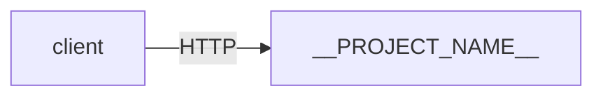

# System Designs Repo Scaffolding Implementation Plan

> **For agentic workers:** REQUIRED SUB-SKILL: Use superpowers:subagent-driven-development (recommended) or superpowers:executing-plans to implement this plan task-by-task. Steps use checkbox (`- [ ]`) syntax for tracking.

**Goal:** Build the repo scaffolding (top-level files, two language templates, and a `new-project.sh` script) so the user can spin up a new BE practice project in one command.

**Architecture:** Categorized folders at top level, fully independent projects, each project bootstrapped from `_templates/{node,python}/` via `scripts/new-project.sh`. Standard `make` interface across languages. Local Docker Compose only.

**Tech Stack:**
- Node template: TypeScript, pnpm, vitest, eslint, prettier, node:20-alpine
- Python template: Python 3.12, uv, pytest, ruff, python:3.12-slim
- Scaffolding: pure bash (no external deps), bash test harness

**Spec:** [`docs/superpowers/specs/2026-06-28-system-designs-repo-architecture-design.md`](../specs/2026-06-28-system-designs-repo-architecture-design.md)

---

## File Map

**Repo-level:**
- Create: `.gitignore`
- Create: `.editorconfig`
- Modify: `README.md` (replace stub with catalog skeleton)

**Node template:**
- Create: `_templates/node/Dockerfile`
- Create: `_templates/node/docker-compose.yml`
- Create: `_templates/node/Makefile`
- Create: `_templates/node/package.json`
- Create: `_templates/node/tsconfig.json`
- Create: `_templates/node/.eslintrc.json`
- Create: `_templates/node/.prettierrc`
- Create: `_templates/node/.env.example`
- Create: `_templates/node/.gitignore`
- Create: `_templates/node/.dockerignore`
- Create: `_templates/node/src/index.ts`
- Create: `_templates/node/tests/smoke.test.ts`
- Create: `_templates/node/README.md`

**Python template:**
- Create: `_templates/python/Dockerfile`
- Create: `_templates/python/docker-compose.yml`
- Create: `_templates/python/Makefile`
- Create: `_templates/python/pyproject.toml`
- Create: `_templates/python/.env.example`
- Create: `_templates/python/.gitignore`
- Create: `_templates/python/.dockerignore`
- Create: `_templates/python/src/__init__.py`
- Create: `_templates/python/src/main.py`
- Create: `_templates/python/tests/__init__.py`
- Create: `_templates/python/tests/test_smoke.py`
- Create: `_templates/python/README.md`

**Scaffolding:**
- Create: `scripts/new-project.sh`
- Create: `scripts/tests/run-tests.sh`
- Create: `scripts/tests/test_new_project.sh`

---

## Task 1: Repo-level baseline files

**Files:**
- Create: `/Users/dong.kyh/works/system-designs/.gitignore`
- Create: `/Users/dong.kyh/works/system-designs/.editorconfig`
- Modify: `/Users/dong.kyh/works/system-designs/README.md`

- [ ] **Step 1: Create `.gitignore`**

```gitignore
# OS
.DS_Store
Thumbs.db

# Editors
.idea/
.vscode/
*.swp
*.swo

# Env files (real, not examples)
.env
.env.local
.env.*.local

# Node
node_modules/
dist/
build/
.pnpm-store/
*.log
npm-debug.log*
yarn-debug.log*
yarn-error.log*

# Python
__pycache__/
*.py[cod]
*$py.class
.venv/
venv/
.pytest_cache/
.ruff_cache/
.mypy_cache/
*.egg-info/

# Docker
docker-compose.override.yml

# Coverage
coverage/
.coverage
htmlcov/
```

- [ ] **Step 2: Create `.editorconfig`**

```ini
root = true

[*]
indent_style = space
indent_size = 2
end_of_line = lf
charset = utf-8
trim_trailing_whitespace = true
insert_final_newline = true

[*.py]
indent_size = 4

[Makefile]
indent_style = tab

[*.md]
trim_trailing_whitespace = false
```

- [ ] **Step 3: Replace `README.md` with catalog skeleton**

Overwrite the existing 2-line stub with:

```markdown
# system-designs

Hands-on practice repo for building backend systems: classic system design problems,
real-world app backends, and distributed-systems primitives.

Every project is self-contained: design doc + code + `docker-compose.yml`, run locally.

**Architecture:** [`docs/superpowers/specs/2026-06-28-system-designs-repo-architecture-design.md`](./docs/superpowers/specs/2026-06-28-system-designs-repo-architecture-design.md)

## Quick start

Spin up a new project:

```bash
./scripts/new-project.sh <category> <project-name> <node|python>
# example:
./scripts/new-project.sh caching distributed-lru-cache node
```

Then:

```bash
cd <category>/<project-name>
make up      # start app + dependencies
make test    # run tests
make down    # stop
```

## Status legend

`📝 planned` · `🚧 in progress` · `✅ done` · `🧊 paused` · `🗑️ archived`

## Catalog

<!-- Update this catalog manually when you finish or abandon a project. -->

### caching
_No projects yet._

### messaging
_No projects yet._

### databases
_No projects yet._

### primitives
_No projects yet._

### apps
_No projects yet._
```

- [ ] **Step 4: Verify file tree**

Run:
```bash
cd /Users/dong.kyh/works/system-designs
ls -la
```
Expected: `.gitignore`, `.editorconfig`, `README.md`, `docs/`, `.git/` all present.

- [ ] **Step 5: Commit**

```bash
cd /Users/dong.kyh/works/system-designs
git add .gitignore .editorconfig README.md
git commit -m "chore: add repo-level baseline (gitignore, editorconfig, README catalog)

Co-authored-by: Copilot <223556219+Copilot@users.noreply.github.com>"
```

---

## Task 2: Node template — config files

**Files:**
- Create: `_templates/node/Dockerfile`
- Create: `_templates/node/docker-compose.yml`
- Create: `_templates/node/Makefile`
- Create: `_templates/node/package.json`
- Create: `_templates/node/tsconfig.json`
- Create: `_templates/node/.eslintrc.json`
- Create: `_templates/node/.prettierrc`
- Create: `_templates/node/.env.example`
- Create: `_templates/node/.gitignore`
- Create: `_templates/node/.dockerignore`

All paths below are relative to `/Users/dong.kyh/works/system-designs/`. Placeholders `__PROJECT_NAME__`, `__CATEGORY__`, `__PROJECT_TITLE__` will be substituted by the scaffolding script (Task 7+). Leave them literal in the template.

- [ ] **Step 1: Create `_templates/node/Dockerfile`**

```dockerfile
# syntax=docker/dockerfile:1
FROM node:20-alpine AS base
WORKDIR /app
RUN corepack enable

FROM base AS deps
COPY package.json pnpm-lock.yaml* ./
RUN pnpm install --frozen-lockfile || pnpm install

FROM base AS build
COPY --from=deps /app/node_modules ./node_modules
COPY . .
RUN pnpm build

FROM base AS runtime
ENV NODE_ENV=production
COPY --from=deps /app/node_modules ./node_modules
COPY --from=build /app/dist ./dist
COPY package.json ./
EXPOSE 3000
CMD ["node", "dist/index.js"]
```

- [ ] **Step 2: Create `_templates/node/docker-compose.yml`**

```yaml
services:
  app:
    build: .
    container_name: __PROJECT_NAME__
    ports:
      - "3000:3000"
    env_file:
      - .env
    # depends_on:
    #   - redis
    #   - postgres

  # Uncomment as needed:
  # redis:
  #   image: redis:7-alpine
  #   ports:
  #     - "6379:6379"
  #
  # postgres:
  #   image: postgres:16-alpine
  #   environment:
  #     POSTGRES_USER: app
  #     POSTGRES_PASSWORD: app
  #     POSTGRES_DB: __PROJECT_NAME__
  #   ports:
  #     - "5432:5432"
  #   volumes:
  #     - pgdata:/var/lib/postgresql/data
  #
  # kafka:
  #   image: bitnami/kafka:3.7
  #   ports:
  #     - "9092:9092"
  #   environment:
  #     KAFKA_CFG_NODE_ID: 0
  #     KAFKA_CFG_PROCESS_ROLES: controller,broker
  #     KAFKA_CFG_CONTROLLER_QUORUM_VOTERS: 0@kafka:9093
  #     KAFKA_CFG_LISTENERS: PLAINTEXT://:9092,CONTROLLER://:9093
  #     KAFKA_CFG_ADVERTISED_LISTENERS: PLAINTEXT://localhost:9092
  #     KAFKA_CFG_CONTROLLER_LISTENER_NAMES: CONTROLLER
  #     KAFKA_CFG_LISTENER_SECURITY_PROTOCOL_MAP: CONTROLLER:PLAINTEXT,PLAINTEXT:PLAINTEXT

# volumes:
#   pgdata:
```

- [ ] **Step 3: Create `_templates/node/Makefile`**

```makefile
.PHONY: up down build test lint logs shell install dev clean

install:
	pnpm install

dev:
	pnpm dev

up:
	docker compose up --build -d

down:
	docker compose down -v

build:
	pnpm build

test:
	pnpm test --run

lint:
	pnpm lint

logs:
	docker compose logs -f app

shell:
	docker compose exec app sh

clean:
	rm -rf node_modules dist coverage
```

- [ ] **Step 4: Create `_templates/node/package.json`**

```json
{
  "name": "__PROJECT_NAME__",
  "version": "0.1.0",
  "private": true,
  "type": "module",
  "scripts": {
    "dev": "tsx watch src/index.ts",
    "build": "tsc -p tsconfig.json",
    "start": "node dist/index.js",
    "test": "vitest",
    "lint": "eslint . && prettier --check ."
  },
  "dependencies": {},
  "devDependencies": {
    "@types/node": "^20.14.0",
    "@typescript-eslint/eslint-plugin": "^7.0.0",
    "@typescript-eslint/parser": "^7.0.0",
    "eslint": "^8.57.0",
    "prettier": "^3.3.0",
    "tsx": "^4.16.0",
    "typescript": "^5.5.0",
    "vitest": "^1.6.0"
  },
  "packageManager": "pnpm@9.0.0"
}
```

- [ ] **Step 5: Create `_templates/node/tsconfig.json`**

```json
{
  "compilerOptions": {
    "target": "ES2022",
    "module": "ESNext",
    "moduleResolution": "Bundler",
    "outDir": "dist",
    "rootDir": "src",
    "strict": true,
    "esModuleInterop": true,
    "skipLibCheck": true,
    "forceConsistentCasingInFileNames": true,
    "resolveJsonModule": true,
    "declaration": false,
    "sourceMap": true
  },
  "include": ["src/**/*"],
  "exclude": ["node_modules", "dist", "tests"]
}
```

- [ ] **Step 6: Create `_templates/node/.eslintrc.json`**

```json
{
  "root": true,
  "parser": "@typescript-eslint/parser",
  "parserOptions": {
    "ecmaVersion": 2022,
    "sourceType": "module"
  },
  "plugins": ["@typescript-eslint"],
  "extends": [
    "eslint:recommended",
    "plugin:@typescript-eslint/recommended"
  ],
  "ignorePatterns": ["dist/", "node_modules/", "coverage/"]
}
```

- [ ] **Step 7: Create `_templates/node/.prettierrc`**

```json
{
  "semi": true,
  "singleQuote": true,
  "trailingComma": "all",
  "printWidth": 100,
  "tabWidth": 2
}
```

- [ ] **Step 8: Create `_templates/node/.env.example`**

```bash
# Document each env variable here. Do NOT put real secrets in this file.
NODE_ENV=development
PORT=3000
```

- [ ] **Step 9: Create `_templates/node/.gitignore`**

```gitignore
node_modules/
dist/
coverage/
.env
.env.local
*.log
.DS_Store
```

- [ ] **Step 10: Create `_templates/node/.dockerignore`**

```
node_modules
dist
coverage
.env
.env.local
.git
*.md
```

- [ ] **Step 11: Commit**

```bash
cd /Users/dong.kyh/works/system-designs
git add _templates/node/
git commit -m "feat(templates): add Node template config files (Dockerfile, compose, Makefile, package.json, tsconfig, lint, env)

Co-authored-by: Copilot <223556219+Copilot@users.noreply.github.com>"
```

---

## Task 3: Node template — source, tests, README

**Files:**
- Create: `_templates/node/src/index.ts`
- Create: `_templates/node/tests/smoke.test.ts`
- Create: `_templates/node/README.md`

- [ ] **Step 1: Create `_templates/node/src/index.ts`**

Minimal HTTP server so the template runs out of the box:

```typescript
import { createServer } from 'node:http';

const port = Number(process.env.PORT ?? 3000);

const server = createServer((req, res) => {
  res.writeHead(200, { 'Content-Type': 'application/json' });
  res.end(JSON.stringify({ service: '__PROJECT_NAME__', status: 'ok' }));
});

server.listen(port, () => {
  console.log(`__PROJECT_NAME__ listening on http://localhost:${port}`);
});

export { server };
```

- [ ] **Step 2: Create `_templates/node/tests/smoke.test.ts`**

```typescript
import { describe, it, expect } from 'vitest';

describe('smoke', () => {
  it('arithmetic works', () => {
    expect(1 + 1).toBe(2);
  });
});
```

- [ ] **Step 3: Create `_templates/node/README.md`**

This is the design doc template that gets copied per project. The placeholders get substituted by the scaffolding script.

````markdown
# __PROJECT_TITLE__

**Category:** `__CATEGORY__` · **Stack:** Node.js (TypeScript)

## 1. Problem statement

_What are we building and why? What problem does it solve?_

## 2. Requirements

### Functional
- [ ] _List the things this system must do_

### Non-functional
- **Scale:** _expected QPS, data volume, number of users_
- **Latency:** _p50 / p95 / p99 targets_
- **Consistency:** _strong / eventual / read-your-writes / etc._
- **Availability:** _e.g. 99.9%_

## 3. API / interface

_HTTP endpoints, message schemas, CLI commands, etc._

```http
GET /health
→ 200 {"service":"__PROJECT_NAME__","status":"ok"}
```

## 4. Architecture

_Components and data flow. Use a mermaid diagram when it helps._



## 5. Data model

_Schemas, indexes, partitioning strategy, retention policy._

## 6. Trade-offs & alternatives

_What was considered, what was chosen, why._

| Decision | Chosen | Alternative | Reasoning |
|---|---|---|---|
| ... | ... | ... | ... |

## 7. How to run

```bash
make up      # start app + dependencies
make test    # run tests
make logs    # tail app logs
make down    # stop and clean volumes
```

Local dev (without Docker):
```bash
make install
make dev
```

## 8. What I learned

_Short retrospective written after building this. Surprises, mistakes, next time._
````

- [ ] **Step 4: Verify the template builds and tests pass (manual smoke)**

Manually scaffold a throwaway copy in a temp dir and run the tests. (We don't have the scaffolding script yet, so use `cp` + `sed`.)

```bash
TMP=$(mktemp -d)
cp -R /Users/dong.kyh/works/system-designs/_templates/node "$TMP/sanity-app"
cd "$TMP/sanity-app"
# Substitute placeholders
find . -type f \( -name '*.json' -o -name '*.ts' -o -name '*.yml' -o -name 'Makefile' -o -name '*.md' \) -exec sed -i.bak \
  -e 's/__PROJECT_NAME__/sanity-app/g' \
  -e 's/__CATEGORY__/sandbox/g' \
  -e 's/__PROJECT_TITLE__/Sanity App/g' {} \;
find . -name '*.bak' -delete
pnpm install
pnpm test --run
```
Expected: `pnpm install` succeeds, `pnpm test --run` reports 1 passing test (`arithmetic works`).

Clean up:
```bash
rm -rf "$TMP"
```

If `pnpm` is not installed: `corepack enable && corepack prepare pnpm@9.0.0 --activate`. If still unavailable, install via `npm i -g pnpm@9` or skip this verification step and document the failure for the user. Do NOT modify the template just to make it pass without pnpm.

- [ ] **Step 5: Commit**

```bash
cd /Users/dong.kyh/works/system-designs
git add _templates/node/src _templates/node/tests _templates/node/README.md
git commit -m "feat(templates): add Node template source, smoke test, and design doc template

Co-authored-by: Copilot <223556219+Copilot@users.noreply.github.com>"
```

---

## Task 4: Python template — config files

**Files:**
- Create: `_templates/python/Dockerfile`
- Create: `_templates/python/docker-compose.yml`
- Create: `_templates/python/Makefile`
- Create: `_templates/python/pyproject.toml`
- Create: `_templates/python/.env.example`
- Create: `_templates/python/.gitignore`
- Create: `_templates/python/.dockerignore`

- [ ] **Step 1: Create `_templates/python/Dockerfile`**

```dockerfile
# syntax=docker/dockerfile:1
FROM python:3.12-slim AS base
WORKDIR /app
ENV PYTHONUNBUFFERED=1 \
    PYTHONDONTWRITEBYTECODE=1 \
    PIP_DISABLE_PIP_VERSION_CHECK=1

RUN pip install --no-cache-dir uv

FROM base AS deps
COPY pyproject.toml uv.lock* ./
RUN uv sync --frozen --no-dev 2>/dev/null || uv sync --no-dev

FROM base AS runtime
COPY --from=deps /app/.venv /app/.venv
ENV PATH="/app/.venv/bin:$PATH"
COPY src ./src
EXPOSE 8000
CMD ["python", "-m", "src.main"]
```

- [ ] **Step 2: Create `_templates/python/docker-compose.yml`**

```yaml
services:
  app:
    build: .
    container_name: __PROJECT_NAME__
    ports:
      - "8000:8000"
    env_file:
      - .env
    # depends_on:
    #   - redis
    #   - postgres

  # Uncomment as needed:
  # redis:
  #   image: redis:7-alpine
  #   ports:
  #     - "6379:6379"
  #
  # postgres:
  #   image: postgres:16-alpine
  #   environment:
  #     POSTGRES_USER: app
  #     POSTGRES_PASSWORD: app
  #     POSTGRES_DB: __PROJECT_NAME__
  #   ports:
  #     - "5432:5432"
  #   volumes:
  #     - pgdata:/var/lib/postgresql/data
  #
  # kafka:
  #   image: bitnami/kafka:3.7
  #   ports:
  #     - "9092:9092"
  #   environment:
  #     KAFKA_CFG_NODE_ID: 0
  #     KAFKA_CFG_PROCESS_ROLES: controller,broker
  #     KAFKA_CFG_CONTROLLER_QUORUM_VOTERS: 0@kafka:9093
  #     KAFKA_CFG_LISTENERS: PLAINTEXT://:9092,CONTROLLER://:9093
  #     KAFKA_CFG_ADVERTISED_LISTENERS: PLAINTEXT://localhost:9092
  #     KAFKA_CFG_CONTROLLER_LISTENER_NAMES: CONTROLLER
  #     KAFKA_CFG_LISTENER_SECURITY_PROTOCOL_MAP: CONTROLLER:PLAINTEXT,PLAINTEXT:PLAINTEXT

# volumes:
#   pgdata:
```

- [ ] **Step 3: Create `_templates/python/Makefile`**

```makefile
.PHONY: up down test lint logs shell install dev clean

install:
	uv sync

dev:
	uv run python -m src.main

up:
	docker compose up --build -d

down:
	docker compose down -v

test:
	uv run pytest -q

lint:
	uv run ruff check . && uv run ruff format --check .

logs:
	docker compose logs -f app

shell:
	docker compose exec app sh

clean:
	rm -rf .venv .pytest_cache .ruff_cache __pycache__ */__pycache__ */*/__pycache__
```

- [ ] **Step 4: Create `_templates/python/pyproject.toml`**

```toml
[project]
name = "__PROJECT_NAME__"
version = "0.1.0"
description = "__PROJECT_TITLE__"
requires-python = ">=3.12"
dependencies = []

[dependency-groups]
dev = [
    "pytest>=8.0",
    "ruff>=0.5",
]

[tool.ruff]
line-length = 100
target-version = "py312"

[tool.ruff.lint]
select = ["E", "F", "I", "B", "UP"]

[tool.pytest.ini_options]
testpaths = ["tests"]
pythonpath = ["."]

[build-system]
requires = ["hatchling"]
build-backend = "hatchling.build"

[tool.hatch.build.targets.wheel]
packages = ["src"]
```

- [ ] **Step 5: Create `_templates/python/.env.example`**

```bash
# Document each env variable here. Do NOT put real secrets in this file.
PORT=8000
```

- [ ] **Step 6: Create `_templates/python/.gitignore`**

```gitignore
__pycache__/
*.py[cod]
*$py.class
.venv/
venv/
dist/
build/
*.egg-info/
.pytest_cache/
.ruff_cache/
.mypy_cache/
.coverage
htmlcov/
.env
.env.local
.DS_Store
```

- [ ] **Step 7: Create `_templates/python/.dockerignore`**

```
.venv
__pycache__
.pytest_cache
.ruff_cache
.env
.env.local
.git
*.md
tests
```

- [ ] **Step 8: Commit**

```bash
cd /Users/dong.kyh/works/system-designs
git add _templates/python/
git commit -m "feat(templates): add Python template config files (Dockerfile, compose, Makefile, pyproject, env)

Co-authored-by: Copilot <223556219+Copilot@users.noreply.github.com>"
```

---

## Task 5: Python template — source, tests, README

**Files:**
- Create: `_templates/python/src/__init__.py`
- Create: `_templates/python/src/main.py`
- Create: `_templates/python/tests/__init__.py`
- Create: `_templates/python/tests/test_smoke.py`
- Create: `_templates/python/README.md`

- [ ] **Step 1: Create `_templates/python/src/__init__.py`**

Empty file:
```python
```

- [ ] **Step 2: Create `_templates/python/src/main.py`**

Minimal HTTP server using only the stdlib (no extra deps to install):

```python
"""__PROJECT_NAME__ — minimal HTTP service."""
from __future__ import annotations

import json
import os
from http.server import BaseHTTPRequestHandler, HTTPServer


class Handler(BaseHTTPRequestHandler):
    def do_GET(self) -> None:
        body = json.dumps({"service": "__PROJECT_NAME__", "status": "ok"}).encode()
        self.send_response(200)
        self.send_header("Content-Type", "application/json")
        self.send_header("Content-Length", str(len(body)))
        self.end_headers()
        self.wfile.write(body)

    def log_message(self, format: str, *args: object) -> None:  # noqa: A002
        return


def main() -> None:
    port = int(os.environ.get("PORT", "8000"))
    server = HTTPServer(("0.0.0.0", port), Handler)
    print(f"__PROJECT_NAME__ listening on http://localhost:{port}")
    server.serve_forever()


if __name__ == "__main__":
    main()
```

- [ ] **Step 3: Create `_templates/python/tests/__init__.py`**

Empty file:
```python
```

- [ ] **Step 4: Create `_templates/python/tests/test_smoke.py`**

```python
def test_arithmetic_works() -> None:
    assert 1 + 1 == 2
```

- [ ] **Step 5: Create `_templates/python/README.md`**

Same structure as the Node README template, swapping the stack and the example command:

````markdown
# __PROJECT_TITLE__

**Category:** `__CATEGORY__` · **Stack:** Python 3.12

## 1. Problem statement

_What are we building and why? What problem does it solve?_

## 2. Requirements

### Functional
- [ ] _List the things this system must do_

### Non-functional
- **Scale:** _expected QPS, data volume, number of users_
- **Latency:** _p50 / p95 / p99 targets_
- **Consistency:** _strong / eventual / read-your-writes / etc._
- **Availability:** _e.g. 99.9%_

## 3. API / interface

_HTTP endpoints, message schemas, CLI commands, etc._

```http
GET /health
→ 200 {"service":"__PROJECT_NAME__","status":"ok"}
```

## 4. Architecture

_Components and data flow. Use a mermaid diagram when it helps._


## 5. Data model

_Schemas, indexes, partitioning strategy, retention policy._

## 6. Trade-offs & alternatives

_What was considered, what was chosen, why._

| Decision | Chosen | Alternative | Reasoning |
|---|---|---|---|
| ... | ... | ... | ... |

## 7. How to run

```bash
make up      # start app + dependencies
make test    # run tests
make logs    # tail app logs
make down    # stop and clean volumes
```

Local dev (without Docker):
```bash
make install
make dev
```

## 8. What I learned

_Short retrospective written after building this. Surprises, mistakes, next time._
````

- [ ] **Step 6: Verify the template by manual scaffold**

```bash
TMP=$(mktemp -d)
cp -R /Users/dong.kyh/works/system-designs/_templates/python "$TMP/sanity-app"
cd "$TMP/sanity-app"
find . -type f \( -name '*.py' -o -name '*.toml' -o -name '*.yml' -o -name 'Makefile' -o -name '*.md' \) -exec sed -i.bak \
  -e 's/__PROJECT_NAME__/sanity_app/g' \
  -e 's/__CATEGORY__/sandbox/g' \
  -e 's/__PROJECT_TITLE__/Sanity App/g' {} \;
find . -name '*.bak' -delete
uv sync
uv run pytest -q
```
Expected: `uv sync` succeeds, `pytest` reports 1 passed.

Clean up:
```bash
rm -rf "$TMP"
```

If `uv` is missing: install per https://docs.astral.sh/uv/getting-started/installation/ (e.g. `curl -LsSf https://astral.sh/uv/install.sh | sh`). Do NOT modify the template just to make verification pass.

Note: pyproject `name = "__PROJECT_NAME__"` with kebab-case names is fine — Python project names allow hyphens. For verification we use `sanity_app` (underscore) because pyproject names accept either; the real scaffolder will pass kebab-case through unchanged.

- [ ] **Step 7: Commit**

```bash
cd /Users/dong.kyh/works/system-designs
git add _templates/python/src _templates/python/tests _templates/python/README.md
git commit -m "feat(templates): add Python template source, smoke test, and design doc template

Co-authored-by: Copilot <223556219+Copilot@users.noreply.github.com>"
```

---

## Task 6: Scaffolding script test harness

We TDD the scaffolding script. To keep dependencies zero, we use a tiny hand-rolled bash test runner. Tests live in `scripts/tests/` and are runnable via `scripts/tests/run-tests.sh`.

**Files:**
- Create: `scripts/tests/run-tests.sh`
- Create: `scripts/tests/test_new_project.sh` (empty placeholder; populated in Task 7)

- [ ] **Step 1: Create `scripts/tests/run-tests.sh`**

```bash
#!/usr/bin/env bash
# Minimal test runner. Sources every test_*.sh in this directory and runs every
# function named test_* it finds. Each test runs in a subshell with `set -e`.

set -u

HERE="$(cd "$(dirname "${BASH_SOURCE[0]}")" && pwd)"
PASS=0
FAIL=0
FAILED_NAMES=()

# Discover test files
shopt -s nullglob
for file in "$HERE"/test_*.sh; do
  # shellcheck disable=SC1090
  source "$file"
done

# Discover test functions defined in the sourced files
TESTS=$(declare -F | awk '{print $3}' | grep '^test_' || true)

for t in $TESTS; do
  printf '  %-60s' "$t"
  if ( set -e; "$t" ) >/tmp/test_out.$$ 2>&1; then
    echo "PASS"
    PASS=$((PASS + 1))
  else
    echo "FAIL"
    echo "    --- output ---"
    sed 's/^/    /' /tmp/test_out.$$
    echo "    --------------"
    FAIL=$((FAIL + 1))
    FAILED_NAMES+=("$t")
  fi
  rm -f /tmp/test_out.$$
done

echo
echo "Results: $PASS passed, $FAIL failed"
if [ $FAIL -gt 0 ]; then
  echo "Failed: ${FAILED_NAMES[*]}"
  exit 1
fi
```

- [ ] **Step 2: Make it executable**

```bash
chmod +x /Users/dong.kyh/works/system-designs/scripts/tests/run-tests.sh
```

- [ ] **Step 3: Create empty `scripts/tests/test_new_project.sh`**

```bash
#!/usr/bin/env bash
# Tests for scripts/new-project.sh
# Tests will be added in Task 7.
```

- [ ] **Step 4: Verify the runner works with no tests**

```bash
/Users/dong.kyh/works/system-designs/scripts/tests/run-tests.sh
```
Expected output:
```
Results: 0 passed, 0 failed
```
Exit code 0.

- [ ] **Step 5: Commit**

```bash
cd /Users/dong.kyh/works/system-designs
git add scripts/tests/run-tests.sh scripts/tests/test_new_project.sh
git commit -m "test(scripts): add minimal bash test runner for scaffolding script

Co-authored-by: Copilot <223556219+Copilot@users.noreply.github.com>"
```

---

## Task 7: Scaffolding script — validation logic (TDD)

We TDD the input-validation behavior of `scripts/new-project.sh`. Validation rules:

- exit 0 on `--help`
- exit non-zero if fewer than 3 args
- exit non-zero if `<lang>` is not `node` or `python`
- exit non-zero if `<name>` is not kebab-case (regex: `^[a-z][a-z0-9-]*[a-z0-9]$`, length ≥ 2)
- exit non-zero if `<category>` is not kebab-case (same regex)
- exit non-zero if the target directory `<repo>/<category>/<name>/` already exists

**Files:**
- Modify: `scripts/tests/test_new_project.sh`
- Create: `scripts/new-project.sh`

- [ ] **Step 1: Replace `scripts/tests/test_new_project.sh` with validation tests**

```bash
#!/usr/bin/env bash
# Tests for scripts/new-project.sh

# Resolve repo root and script path
REPO_ROOT="$(cd "$(dirname "${BASH_SOURCE[0]}")/../.." && pwd)"
SCRIPT="$REPO_ROOT/scripts/new-project.sh"

# Run the script in a sandboxed copy of the repo so we don't pollute the working
# tree. The sandbox contains only what the script needs: _templates/ and the
# script itself.
setup_sandbox() {
  SANDBOX=$(mktemp -d)
  mkdir -p "$SANDBOX/scripts"
  cp -R "$REPO_ROOT/_templates" "$SANDBOX/_templates"
  cp "$SCRIPT" "$SANDBOX/scripts/new-project.sh"
  chmod +x "$SANDBOX/scripts/new-project.sh"
  echo "$SANDBOX"
}

teardown_sandbox() {
  rm -rf "$1"
}

# ---------- validation tests ----------

test_help_flag_exits_zero() {
  local box; box=$(setup_sandbox)
  ( cd "$box" && ./scripts/new-project.sh --help >/dev/null )
  local rc=$?
  teardown_sandbox "$box"
  [ $rc -eq 0 ]
}

test_no_args_exits_nonzero() {
  local box; box=$(setup_sandbox)
  set +e
  ( cd "$box" && ./scripts/new-project.sh >/dev/null 2>&1 )
  local rc=$?
  set -e
  teardown_sandbox "$box"
  [ $rc -ne 0 ]
}

test_two_args_exits_nonzero() {
  local box; box=$(setup_sandbox)
  set +e
  ( cd "$box" && ./scripts/new-project.sh caching url-shortener >/dev/null 2>&1 )
  local rc=$?
  set -e
  teardown_sandbox "$box"
  [ $rc -ne 0 ]
}

test_invalid_lang_exits_nonzero() {
  local box; box=$(setup_sandbox)
  set +e
  ( cd "$box" && ./scripts/new-project.sh caching url-shortener rust >/dev/null 2>&1 )
  local rc=$?
  set -e
  teardown_sandbox "$box"
  [ $rc -ne 0 ]
}

test_invalid_name_uppercase_exits_nonzero() {
  local box; box=$(setup_sandbox)
  set +e
  ( cd "$box" && ./scripts/new-project.sh caching URLShortener node >/dev/null 2>&1 )
  local rc=$?
  set -e
  teardown_sandbox "$box"
  [ $rc -ne 0 ]
}

test_invalid_name_underscore_exits_nonzero() {
  local box; box=$(setup_sandbox)
  set +e
  ( cd "$box" && ./scripts/new-project.sh caching url_shortener node >/dev/null 2>&1 )
  local rc=$?
  set -e
  teardown_sandbox "$box"
  [ $rc -ne 0 ]
}

test_invalid_category_uppercase_exits_nonzero() {
  local box; box=$(setup_sandbox)
  set +e
  ( cd "$box" && ./scripts/new-project.sh Caching url-shortener node >/dev/null 2>&1 )
  local rc=$?
  set -e
  teardown_sandbox "$box"
  [ $rc -ne 0 ]
}

test_existing_target_exits_nonzero() {
  local box; box=$(setup_sandbox)
  mkdir -p "$box/caching/url-shortener"
  set +e
  ( cd "$box" && ./scripts/new-project.sh caching url-shortener node >/dev/null 2>&1 )
  local rc=$?
  set -e
  teardown_sandbox "$box"
  [ $rc -ne 0 ]
}

test_valid_inputs_exit_zero_node() {
  local box; box=$(setup_sandbox)
  ( cd "$box" && ./scripts/new-project.sh caching url-shortener node >/dev/null )
  local rc=$?
  teardown_sandbox "$box"
  [ $rc -eq 0 ]
}

test_valid_inputs_exit_zero_python() {
  local box; box=$(setup_sandbox)
  ( cd "$box" && ./scripts/new-project.sh apps news-feed python >/dev/null )
  local rc=$?
  teardown_sandbox "$box"
  [ $rc -eq 0 ]
}
```

- [ ] **Step 2: Run the tests — expect all to fail (script doesn't exist yet)**

```bash
/Users/dong.kyh/works/system-designs/scripts/tests/run-tests.sh
```
Expected: every test shows `FAIL` (script not found). Exit code 1.

- [ ] **Step 3: Create `scripts/new-project.sh` with validation only (no copy logic yet)**

Note: this version does just enough to make the validation tests pass. The actual copy + substitution logic is added in Task 8.

```bash
#!/usr/bin/env bash
set -euo pipefail

USAGE="Usage: $0 <category> <project-name> <node|python>

Scaffolds a new project from _templates/<lang>/ into <category>/<project-name>/.

Arguments:
  <category>      kebab-case category folder name (e.g. caching, apps)
  <project-name>  kebab-case project name (e.g. url-shortener)
  <lang>          node or python

Examples:
  $0 caching distributed-lru-cache node
  $0 apps news-feed python
"

KEBAB_RE='^[a-z][a-z0-9-]*[a-z0-9]$'

die() {
  echo "error: $*" >&2
  echo "" >&2
  echo "$USAGE" >&2
  exit 1
}

if [ "${1:-}" = "--help" ] || [ "${1:-}" = "-h" ]; then
  echo "$USAGE"
  exit 0
fi

if [ "$#" -ne 3 ]; then
  die "expected 3 arguments, got $#"
fi

CATEGORY="$1"
NAME="$2"
LANG="$3"

if [[ "$LANG" != "node" && "$LANG" != "python" ]]; then
  die "<lang> must be 'node' or 'python' (got '$LANG')"
fi

if ! [[ "$CATEGORY" =~ $KEBAB_RE ]]; then
  die "<category> must be kebab-case (got '$CATEGORY')"
fi

if ! [[ "$NAME" =~ $KEBAB_RE ]]; then
  die "<project-name> must be kebab-case (got '$NAME')"
fi

# Resolve repo root (one level up from this script).
SCRIPT_DIR="$(cd "$(dirname "${BASH_SOURCE[0]}")" && pwd)"
REPO_ROOT="$(cd "$SCRIPT_DIR/.." && pwd)"
TEMPLATE_DIR="$REPO_ROOT/_templates/$LANG"
TARGET_DIR="$REPO_ROOT/$CATEGORY/$NAME"

if [ ! -d "$TEMPLATE_DIR" ]; then
  die "template not found: $TEMPLATE_DIR"
fi

if [ -e "$TARGET_DIR" ]; then
  die "target already exists: $TARGET_DIR"
fi

# Copy + substitute logic added in Task 8.
# For now, just create the target dir so the valid-input tests pass.
mkdir -p "$TARGET_DIR"
echo "scaffolded $TARGET_DIR (placeholder — copy logic pending)"
```

- [ ] **Step 4: Make it executable**

```bash
chmod +x /Users/dong.kyh/works/system-designs/scripts/new-project.sh
```

- [ ] **Step 5: Run the tests — expect all to pass**

```bash
/Users/dong.kyh/works/system-designs/scripts/tests/run-tests.sh
```
Expected: `Results: 10 passed, 0 failed`. Exit code 0.

- [ ] **Step 6: Commit**

```bash
cd /Users/dong.kyh/works/system-designs
git add scripts/new-project.sh scripts/tests/test_new_project.sh
git commit -m "feat(scripts): add new-project.sh with input validation (TDD)

Validates <category>, <project-name>, <lang>; handles --help and
existing-target errors. Copy + substitution logic deferred to next commit.

Co-authored-by: Copilot <223556219+Copilot@users.noreply.github.com>"
```

---

## Task 8: Scaffolding script — copy + placeholder substitution (TDD)

Now add the actual scaffolding behavior: copy `_templates/<lang>/` to the target and substitute `__PROJECT_NAME__`, `__CATEGORY__`, `__PROJECT_TITLE__` in all text files.

**Files:**
- Modify: `scripts/tests/test_new_project.sh`
- Modify: `scripts/new-project.sh`

- [ ] **Step 1: Append behavior tests to `scripts/tests/test_new_project.sh`**

Append these functions to the bottom of the file:

```bash
# ---------- scaffold behavior tests ----------

test_scaffold_node_creates_expected_files() {
  local box; box=$(setup_sandbox)
  ( cd "$box" && ./scripts/new-project.sh caching url-shortener node >/dev/null )
  local rc=$?
  if [ $rc -ne 0 ]; then teardown_sandbox "$box"; return 1; fi

  local target="$box/caching/url-shortener"
  for f in README.md Dockerfile docker-compose.yml Makefile package.json tsconfig.json \
           .eslintrc.json .prettierrc .env.example .gitignore .dockerignore \
           src/index.ts tests/smoke.test.ts; do
    if [ ! -f "$target/$f" ]; then
      echo "missing file: $f"
      teardown_sandbox "$box"
      return 1
    fi
  done
  teardown_sandbox "$box"
}

test_scaffold_python_creates_expected_files() {
  local box; box=$(setup_sandbox)
  ( cd "$box" && ./scripts/new-project.sh apps news-feed python >/dev/null )
  local rc=$?
  if [ $rc -ne 0 ]; then teardown_sandbox "$box"; return 1; fi

  local target="$box/apps/news-feed"
  for f in README.md Dockerfile docker-compose.yml Makefile pyproject.toml \
           .env.example .gitignore .dockerignore \
           src/__init__.py src/main.py tests/__init__.py tests/test_smoke.py; do
    if [ ! -f "$target/$f" ]; then
      echo "missing file: $f"
      teardown_sandbox "$box"
      return 1
    fi
  done
  teardown_sandbox "$box"
}

test_scaffold_substitutes_project_name() {
  local box; box=$(setup_sandbox)
  ( cd "$box" && ./scripts/new-project.sh caching url-shortener node >/dev/null )
  local target="$box/caching/url-shortener"
  if grep -r '__PROJECT_NAME__' "$target" >/dev/null 2>&1; then
    echo "found unsubstituted __PROJECT_NAME__"
    teardown_sandbox "$box"
    return 1
  fi
  grep -q '"name": "url-shortener"' "$target/package.json" || { teardown_sandbox "$box"; return 1; }
  teardown_sandbox "$box"
}

test_scaffold_substitutes_category() {
  local box; box=$(setup_sandbox)
  ( cd "$box" && ./scripts/new-project.sh caching url-shortener node >/dev/null )
  local target="$box/caching/url-shortener"
  if grep -r '__CATEGORY__' "$target" >/dev/null 2>&1; then
    echo "found unsubstituted __CATEGORY__"
    teardown_sandbox "$box"
    return 1
  fi
  grep -q '`caching`' "$target/README.md" || { teardown_sandbox "$box"; return 1; }
  teardown_sandbox "$box"
}

test_scaffold_substitutes_project_title() {
  local box; box=$(setup_sandbox)
  ( cd "$box" && ./scripts/new-project.sh caching url-shortener node >/dev/null )
  local target="$box/caching/url-shortener"
  if grep -r '__PROJECT_TITLE__' "$target" >/dev/null 2>&1; then
    echo "found unsubstituted __PROJECT_TITLE__"
    teardown_sandbox "$box"
    return 1
  fi
  grep -q '^# Url Shortener' "$target/README.md" || { teardown_sandbox "$box"; return 1; }
  teardown_sandbox "$box"
}

test_scaffold_creates_category_when_missing() {
  local box; box=$(setup_sandbox)
  ( cd "$box" && ./scripts/new-project.sh networking dns-resolver python >/dev/null )
  [ -d "$box/networking/dns-resolver" ] || { teardown_sandbox "$box"; return 1; }
  teardown_sandbox "$box"
}

test_scaffold_does_not_modify_templates() {
  local box; box=$(setup_sandbox)
  ( cd "$box" && ./scripts/new-project.sh caching url-shortener node >/dev/null )
  # Templates should still contain unsubstituted placeholders.
  grep -q '__PROJECT_NAME__' "$box/_templates/node/package.json" || { teardown_sandbox "$box"; return 1; }
  teardown_sandbox "$box"
}
```

- [ ] **Step 2: Run the tests — new behavior tests should FAIL, validation tests still PASS**

```bash
/Users/dong.kyh/works/system-designs/scripts/tests/run-tests.sh
```
Expected: 10 validation tests pass, 7 new behavior tests fail (because `new-project.sh` only creates an empty directory).

- [ ] **Step 3: Update `scripts/new-project.sh` with copy + substitution**

Replace the entire file with the version below. Differences from the previous version: hides the placeholder message, copies the template, substitutes placeholders, prints next steps.

```bash
#!/usr/bin/env bash
set -euo pipefail

USAGE="Usage: $0 <category> <project-name> <node|python>

Scaffolds a new project from _templates/<lang>/ into <category>/<project-name>/.

Arguments:
  <category>      kebab-case category folder name (e.g. caching, apps)
  <project-name>  kebab-case project name (e.g. url-shortener)
  <lang>          node or python

Examples:
  $0 caching distributed-lru-cache node
  $0 apps news-feed python
"

KEBAB_RE='^[a-z][a-z0-9-]*[a-z0-9]$'

die() {
  echo "error: $*" >&2
  echo "" >&2
  echo "$USAGE" >&2
  exit 1
}

if [ "${1:-}" = "--help" ] || [ "${1:-}" = "-h" ]; then
  echo "$USAGE"
  exit 0
fi

if [ "$#" -ne 3 ]; then
  die "expected 3 arguments, got $#"
fi

CATEGORY="$1"
NAME="$2"
LANG="$3"

if [[ "$LANG" != "node" && "$LANG" != "python" ]]; then
  die "<lang> must be 'node' or 'python' (got '$LANG')"
fi

if ! [[ "$CATEGORY" =~ $KEBAB_RE ]]; then
  die "<category> must be kebab-case (got '$CATEGORY')"
fi

if ! [[ "$NAME" =~ $KEBAB_RE ]]; then
  die "<project-name> must be kebab-case (got '$NAME')"
fi

SCRIPT_DIR="$(cd "$(dirname "${BASH_SOURCE[0]}")" && pwd)"
REPO_ROOT="$(cd "$SCRIPT_DIR/.." && pwd)"
TEMPLATE_DIR="$REPO_ROOT/_templates/$LANG"
TARGET_DIR="$REPO_ROOT/$CATEGORY/$NAME"

if [ ! -d "$TEMPLATE_DIR" ]; then
  die "template not found: $TEMPLATE_DIR"
fi

if [ -e "$TARGET_DIR" ]; then
  die "target already exists: $TARGET_DIR"
fi

# Build a Title Case version of the kebab-case name: "url-shortener" -> "Url Shortener".
# Written for bash 3.2 compatibility (macOS default) — avoids ${var^} which needs bash 4+.
to_title() {
  local s="$1"
  local out=""
  local first rest
  local IFS='-'
  for w in $s; do
    first=$(printf '%s' "${w:0:1}" | tr '[:lower:]' '[:upper:]')
    rest="${w:1}"
    out="${out}${first}${rest} "
  done
  # Strip trailing space.
  printf '%s' "${out% }"
}

PROJECT_TITLE="$(to_title "$NAME")"

# Copy the template (preserving hidden files).
mkdir -p "$(dirname "$TARGET_DIR")"
cp -R "$TEMPLATE_DIR" "$TARGET_DIR"

# Substitute placeholders in every regular file in the target.
# Using a tmp file pattern because BSD sed (macOS) and GNU sed differ on `-i`.
sub_in_file() {
  local f="$1"
  local tmp
  tmp="$(mktemp)"
  sed \
    -e "s|__PROJECT_NAME__|${NAME}|g" \
    -e "s|__CATEGORY__|${CATEGORY}|g" \
    -e "s|__PROJECT_TITLE__|${PROJECT_TITLE}|g" \
    "$f" > "$tmp"
  mv "$tmp" "$f"
}

# Walk all regular files; skip binaries by checking with `file` would be more robust,
# but for these templates everything is text. Still avoid following symlinks.
while IFS= read -r -d '' f; do
  sub_in_file "$f"
done < <(find "$TARGET_DIR" -type f -print0)

cat <<EOF
✓ Scaffolded $CATEGORY/$NAME ($LANG)

Next steps:
  cd $CATEGORY/$NAME
  \$EDITOR README.md     # write your design
  make install           # install deps (and create lockfile)
  make up                # start app + dependencies in Docker
  make test              # run tests

Remember to add an entry under "### $CATEGORY" in the top-level README catalog
when you start or finish the project.
EOF
```

- [ ] **Step 4: Run the tests — all should pass**

```bash
/Users/dong.kyh/works/system-designs/scripts/tests/run-tests.sh
```
Expected: `Results: 17 passed, 0 failed`. Exit code 0.

- [ ] **Step 5: Commit**

```bash
cd /Users/dong.kyh/works/system-designs
git add scripts/new-project.sh scripts/tests/test_new_project.sh
git commit -m "feat(scripts): implement template copy + placeholder substitution

Substitutes __PROJECT_NAME__, __CATEGORY__, __PROJECT_TITLE__ in every
file under the new project dir. Uses a tmp-file sed pattern so it works
on both BSD (macOS) and GNU sed. Templates remain unchanged after run.

Co-authored-by: Copilot <223556219+Copilot@users.noreply.github.com>"
```

---

## Task 9: End-to-end verification

Use the real scaffolding script to produce one Node project and one Python project in throwaway locations (outside the working tree to avoid creating real catalog entries), and run their respective test suites.

**Files:** none (verification only)

- [ ] **Step 1: Scaffold a throwaway Node project and run its tests**

```bash
cd /Users/dong.kyh/works/system-designs

# Use a temp sandbox so we don't litter the repo with a "verification" project.
SANDBOX=$(mktemp -d)
mkdir -p "$SANDBOX/scripts"
cp -R _templates "$SANDBOX/_templates"
cp scripts/new-project.sh "$SANDBOX/scripts/new-project.sh"
chmod +x "$SANDBOX/scripts/new-project.sh"

cd "$SANDBOX"
./scripts/new-project.sh caching e2e-node-check node
cd caching/e2e-node-check
pnpm install
pnpm test --run
```
Expected: `pnpm test --run` reports 1 passed test (`arithmetic works`).

- [ ] **Step 2: Scaffold a throwaway Python project in the same sandbox and run its tests**

```bash
cd "$SANDBOX"
./scripts/new-project.sh apps e2e-py-check python
cd apps/e2e-py-check
uv sync
uv run pytest -q
```
Expected: pytest reports 1 passed test.

- [ ] **Step 3: Verify no placeholders remain in either project**

```bash
cd "$SANDBOX"
! grep -r -E '__PROJECT_NAME__|__CATEGORY__|__PROJECT_TITLE__' caching apps
```
Expected: command exits 0 (no matches) — `!` inverts grep's non-zero "no matches" exit.

- [ ] **Step 4: Clean up the sandbox**

```bash
rm -rf "$SANDBOX"
```

- [ ] **Step 5: Final repo sanity check**

```bash
cd /Users/dong.kyh/works/system-designs
git status
ls
```
Expected: working tree clean. Top level shows `_templates/`, `docs/`, `scripts/`, `README.md`, `.gitignore`, `.editorconfig` (and `.git/`). No leaked `caching/` or `apps/` directories from verification.

- [ ] **Step 6: Tag the milestone (optional but useful)**

```bash
cd /Users/dong.kyh/works/system-designs
git tag -a scaffolding-v1 -m "Repo scaffolding complete: templates + new-project.sh + tests"
```

---

## Done

After Task 9, you can scaffold real practice projects with:

```bash
./scripts/new-project.sh <category> <project-name> <node|python>
```

The first real project you build is a good moment to test the workflow end-to-end with real intent. If anything feels clunky, iterate on the templates — they exist to serve you, not the other way around.
